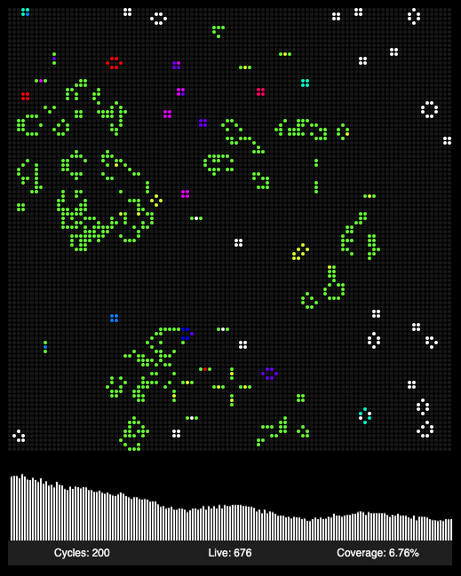

## About the Project

This is a modular React app with Styled Components and Jest tests.

It has a lot of changing React elements - in current state it's 10,166 (100\*100+166), which is quite interesting and unusual for a "normal" web app. Of course, it would make much more sense to use something like PixiJS for rendering, but that is not the purpose of this project.

**NOTE: It stops after 500 cycles. Desktop/Tablet version only.**

## Conway's Game Of Life

[Wikipedia article](https://en.wikipedia.org/wiki/Conway%27s_Game_of_Life)

The Game of Life, also known simply as Life, is a cellular automaton devised by the British mathematician John Horton Conway in 1970. The game is a zero-player game, meaning that its evolution is determined by its initial state, requiring no further input.

**Rules**

The universe of the Game of Life is an infinite, two-dimensional orthogonal grid of square cells, each of which is in one of two possible states, alive or dead, (or populated and unpopulated, respectively). Every cell interacts with its eight neighbours, which are the cells that are horizontally, vertically, or diagonally adjacent. At each step in time, the following transitions occur:

- Any live cell with fewer than two live neighbours dies, as if by underpopulation.
- Any live cell with two or three live neighbours lives on to the next generation.
- Any live cell with more than three live neighbours dies, as if by overpopulation.
- Any dead cell with exactly three live neighbours becomes a live cell, as if by reproduction.
